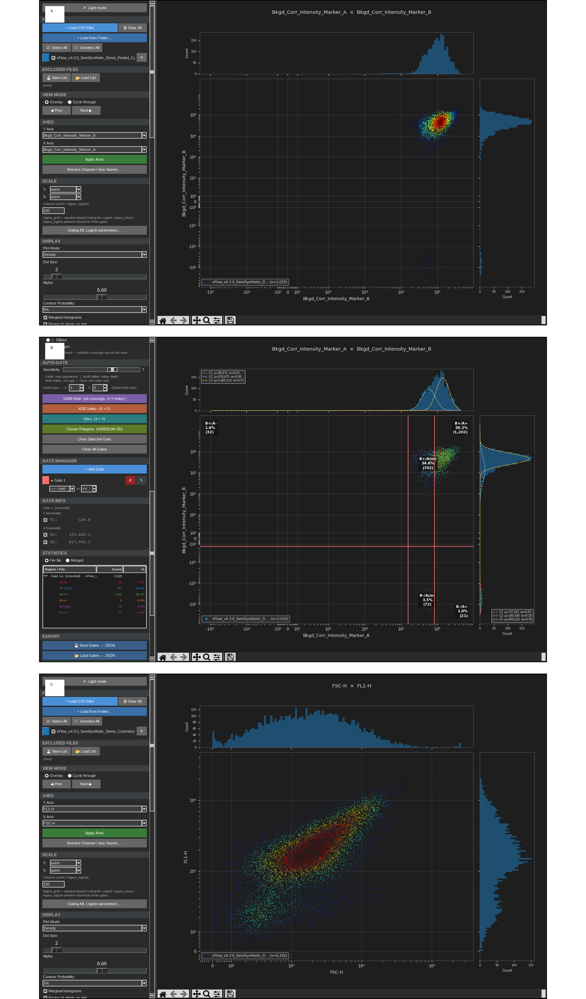
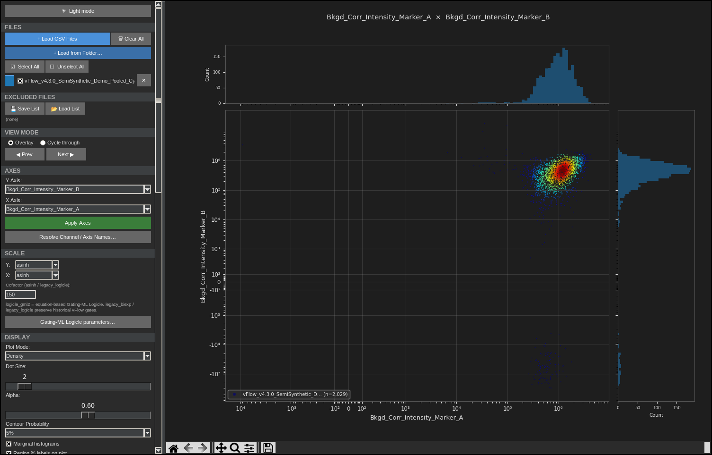
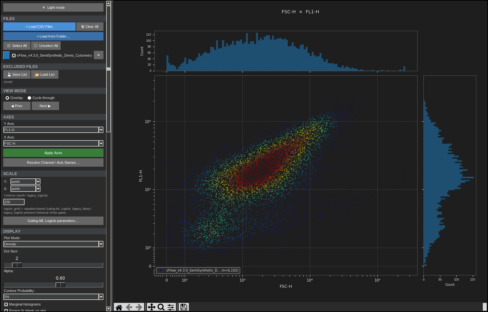
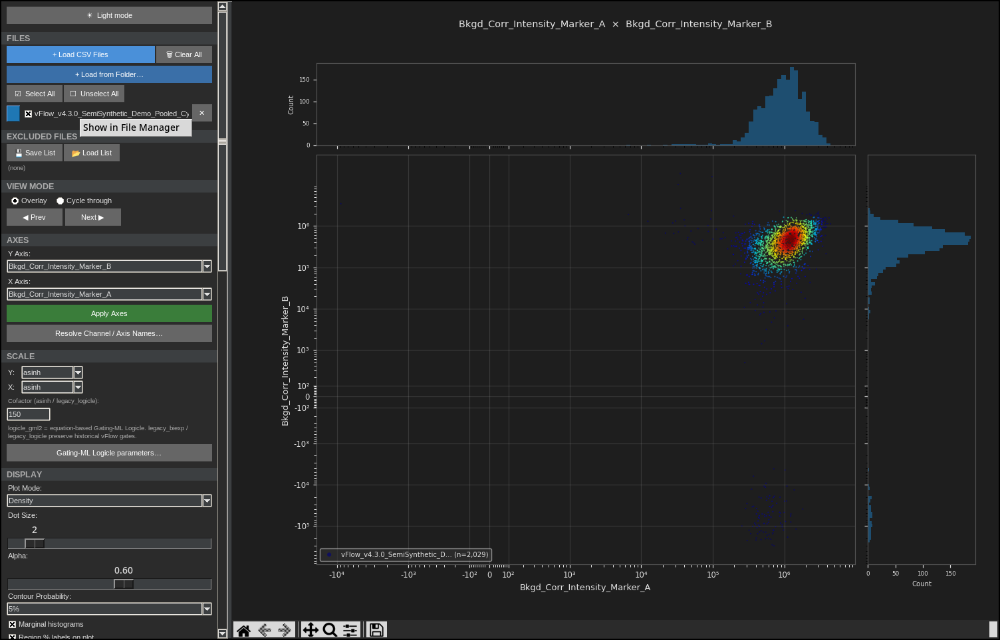
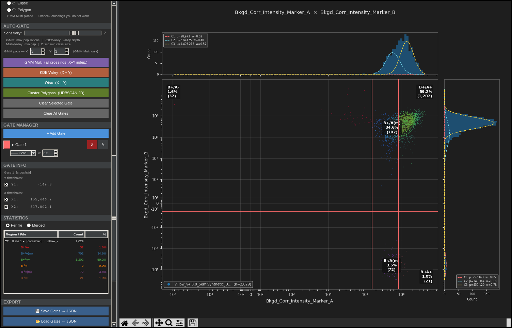
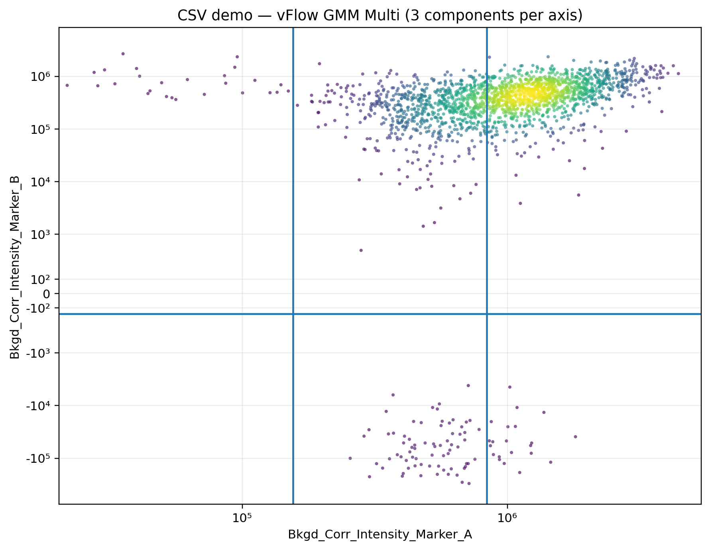

# vFlow v4.3.0 User Guide

**Fluorescence Particle Population Analysis — from Microscopy to Cytometry**

This manual documents vFlow 4.3.0 using the frozen semi-synthetic demonstration datasets included with this bundle.

---

## 1. Scope and design philosophy

vFlow is a desktop application for **visualising, defining, quantifying, and quality-controlling populations of individually measured fluorescent particles**.

Its primary scientific workflow is microscopy-derived particle analysis:

**fluorescence microscopy → particle segmentation/validation → per-particle CSV measurements → vFlow population analysis**

Upstream image-analysis software performs segmentation and object validation. A typical exported table contains one row per validated particle and numeric measurements such as raw fluorescence, local background, background-corrected intensity, marker-specific centroid coordinates, inter-centroid distance, and other numeric particle descriptors.

vFlow begins from those measurements. It does **not** replace the upstream microscopy or segmentation workflow.

Because flow cytometry has the same basic list-mode structure—one event per row and measured parameters in columns—vFlow also supports FCS data. Cytometry is a compatible extension of the same population-analysis model rather than the original scientific centre of the application.

### The three development pillars

| Pillar | Practical goal |
|---|---|
| **1. Visualization & interaction** | Make heterogeneous particle populations easy to inspect, transform, compare, gate, and sub-gate without rewriting analysis code. |
| **2. Scientific robustness & quality control** | Keep parameter identity, transformations, denominators, gate lineage, provenance, invalid states, and source files explicit and traceable. |
| **3. Automation & performance** | Reduce repetitive processing with automated candidate gates, folder/batch workflows, caching, subsampling, and responsive rendering while retaining user oversight. |

These pillars are used throughout this manual. Features are described not only by what control they provide, but by **what scientific question they address, what assumptions they make, and what quality-control checks remain the user's responsibility**.

---

## 2. Demonstration files

The documentation uses two semi-synthetic files. The **CSV file is the primary microscopy-style demonstration dataset**. The FCS file demonstrates how the same downstream population-analysis interface extends to conventional cytometry.

### Primary microscopy-style CSV

`datasets/vFlow_v4.3.0_SemiSynthetic_Demo_Pooled_CytoFile.csv`

Canonical settings:

- X: `Bkgd_Corr_Intensity_Marker_A`
- Y: `Bkgd_Corr_Intensity_Marker_B`
- X/Y scale: `asinh`
- cofactor: `150`
- plot mode: `Density`
- marginal histograms: on

The canonical axes are **background-corrected fluorescence intensities**. Negative values are preserved because a locally measured background may legitimately exceed a weak particle signal; those measurements are not automatically invalid events.

### Compatible FCS example

`datasets/vFlow_v4.3.0_SemiSynthetic_Demo_Cytometry.fcs`

Canonical settings:

- X: `FSC-H`
- Y: `FL1-H`
- generated-documentation scale: `asinh / asinh`
- cofactor: `150`
- plot mode: `Density`
- marginal histograms: on

The datasets are semi-synthetic. See [`DEMO_DATASETS.md`](DEMO_DATASETS.md).

---

## 3. Interface

The main window provides a scrollable left sidebar and a central plotting canvas. The sidebar contains file management, view mode, axes, scale, display, gating, statistics, analysis and export controls.

Use the top **Light mode / Dark mode** control to switch theme.

The control panel maps naturally onto the three development pillars:

- **Visualization:** file selection, axes, transforms, plot modes, marginals, axis fitting, and navigation.
- **Scientific robustness / QC:** source-file traceability, explicit parameter resolution, gate context, region statistics, session/gate provenance, and conservative error handling.
- **Automation / performance:** auto-gating, folder workflows, batch processing, display subsampling, and cached calculations.

The principal UI screenshots in this revised guide were captured from the **actual vFlow 4.3.0 Tk/Matplotlib application running against the frozen demonstration datasets**. They are not reconstructed mock-ups. The captures were made under Linux, so operating-system window chrome and platform-specific file-manager wording can differ on macOS or Windows.

---

## 4. Loading and managing files

### Load files

Load one or more CSV or FCS files. For the primary microscopy workflow, each CSV row should represent one validated particle/object and the numeric columns should represent quantitative measurements. Each loaded file appears in the **FILES** panel with a visibility checkbox.

Supported FCS functionality includes FCS 2.0/3.0/3.1, supported float/double/integer payloads, endian handling and channel-name parsing.

CSV files require headers; numeric columns become available as candidate analysis parameters. These may be fluorescence intensities, background-corrected values, distances, morphology-derived quantities, or other numeric particle features.

### Exclude / restore

Use a file row's **×** control to move it to **EXCLUDED FILES**. Restore it later without reloading from disk.

### Reveal the original source-file location

Right-click **any visible part of a loaded or excluded file row** to reveal that source file in the operating-system file manager. The context menu is bound to the whole row, including the row background, colour swatch, checkbox/file name and exclude/restore controls.

The command is labelled:

- **macOS:** `Show in Finder`
- **Windows:** `Show in Explorer`
- **Linux:** `Show in File Manager`

On macOS, **Control-click** and the supported secondary mouse button are also accepted.

This action only asks the operating-system file manager to reveal the existing path. It does **not** open, execute, modify, rename, move or delete the scientific data file.

### Clear All

Clears loaded/excluded file state. v4.3.0 also clears stale artists, channel selections and locked axis state so the next dataset opens cleanly.

### Load from Folder

Folder mode recursively scans experiment directories. Selected CSVs can be concatenated/exported with a `Source_File` column for later per-sample Batch Plot analysis.

---

## 5. View modes

### Overlay

Displays all compatible active files simultaneously.

### Cycle through

Displays one active file at a time. Use **Prev** / **Next** to move through files.

Channel identity is handled conservatively in v4.3.0; ambiguous multi-file mappings are not guessed.

---

## 6. Axes

Select any available X and Y parameters and click **Apply Axes**.

In microscopy-derived CSV data, an axis can represent fluorescence intensity, corrected intensity, distance, or another numeric particle measurement. In FCS data, the same selectors expose scatter, fluorescence, pulse-geometry, time, or other instrument parameters.

### Canonical CSV

### Canonical FCS

Use **Resolve Channel / Axis Names…** when channel naming needs explicit resolution.

---

## 7. Scales

The v4.3.0 UI exposes:

| Scale | Use |
|---|---|
| `linear` | untransformed numeric values |
| `log` | strictly positive wide-range data |
| `asinh` | positive/negative values with a controllable linear region |
| `logicle_gml2` | standards-reproducible Gating-ML Logicle |
| `legacy_biexp` | historical vFlow compatibility |
| `legacy_logicle` | historical vFlow compatibility |

### Cofactor

The cofactor applies to `asinh` and `legacy_logicle`. The demo uses **150**.

### Gating-ML Logicle parameters

The **Gating-ML Logicle parameters…** dialog exposes explicit `T/W/M/A` settings when `logicle_gml2` is selected.

### Linear versus asinh

CSV linear:

CSV asinh:

FCS linear:

FCS asinh:

Background-corrected microscopy values can legitimately be negative. `asinh` is therefore often particularly useful because it remains defined on both sides of zero while compressing large tails. Do not discard negative corrected values solely because a strict logarithmic axis cannot display them.

### Scale changes and gates

Gates remain associated with their ordered X/Y channels. A display-transform change on the same channels rebinds/recomputes the gate context; selecting genuinely different channels makes that gate inactive until the original channels return.

---

## 8. Plot modes

### Dot Plot

Shows individual events.

### Density

Highlights high- and low-density regions while keeping event-level structure.

### Contour Plot

The Contour Probability control offers 2%, 5%, 10% and 20%.

### Other display controls

- Dot Size
- Alpha
- Marginal histograms
- Region % labels on plot
- Legend
- Grid
- Fit axes to data
- Lock & adjust scale

**Fit axes to data** focuses on the visible distribution. **Lock & adjust scale** freezes current limits and allows manual endpoint adjustment.

---

## 9. Marginal histograms

Marginals show one-dimensional X/Y distributions around the central plot. They help identify multimodality, threshold placement and sparse tails.

They also support additional overlays, including GMM component curves and population shading for compatible automatic gates.

---

## 10. Manual gating

Manual gates are **population definitions**, not image-segmentation operations. They act on measurements already exported for validated particles/events.

Typical microscopy uses include separating low/high fluorescence, defining single- and double-positive populations, sub-gating a fluorescence-defined population by distance, or retaining investigator control over a rare shoulder that should not be assigned automatically.

Enable **Draw** mode and choose:

- Crosshair
- Rectangle
- Ellipse
- Polygon

### Crosshair

The illustrative thresholds in this manual are X = 800,000 and Y = 0.

- **A− / B−:** 72 events (3.5%)
- **A+ / B−:** 21 events (1.0%)
- **A− / B+:** 689 events (34.0%)
- **A+ / B+:** 1,247 events (61.5%)

### Rectangle

Click-drag a rectangular region.

### Ellipse

Useful for approximately elliptical event clouds.

### Polygon

Place vertices around an irregular population and close the polygon.

### Editing

Right-drag gate handles to reshape. Gate Mode Off prevents accidental creation while still permitting supported editing/sub-gating interactions.

---

## 11. Automatic gating

Automatic gates are designed to **accelerate candidate population definition**, not to assign biological identity. Inspect every automatic result against the underlying distribution, marginal histograms, controls, and experimental question.

A central vFlow principle is: **do not manufacture a separator merely because an algorithm was requested**.

### KDE Valley

Detects a supported KDE valley independently on each axis. v4.3.0 fails closed when no defensible two-population valley is found.

### Otsu

The frozen demo gives raw-unit thresholds approximately:

- X: **776,830.9**
- Y: **-4,221.0**

### GMM Multi

The **CSV demonstration** is used for the GMM Multi example because its background-corrected intensity distributions contain a dominant positive population together with lower/negative sub-populations. This makes the independent X/Y mixture crossings easy to see and is a more instructive use of this method than the FCS example.

The screenshot below was captured from the **actual vFlow 4.3.0 UI** with:

- X = `Bkgd_Corr_Intensity_Marker_A`
- Y = `Bkgd_Corr_Intensity_Marker_B`
- scale = `asinh / asinh`
- cofactor = `150`
- GMM pops X = `3`
- GMM pops Y = `3`

The screenshot simultaneously shows the Auto-Gate controls, Gate Manager, Gate Info threshold checkboxes, Statistics table, region labels and fitted Gaussian component curves in the marginal histograms.

A standalone publication-friendly rendering of the same thresholds is provided here:

GMM Multi fits an **exact user-selected number** of one-dimensional Gaussian mixture components independently on X and Y, then places every supported equal-density crossing between adjacent components.

For the frozen CSV demo and `N = 3` components per axis, vFlow 4.3.0 returns:

**X crossings**
- 155,446.3
- 837,002.1

**Y crossings**
- -149.8

Each crossing is exposed as an individual checkbox in **Gate Info**, so a user can disable a mathematically supported crossing that is not useful for the biological or analytical question.

#### Why three fitted components can produce only one threshold

The number of fitted Gaussian components and the number of supported population separators are not the same quantity. vFlow does **not** force `K−1` thresholds merely because `K` Gaussian components were requested. An adjacent pair becomes a threshold only when their **weighted fitted densities cross between the fitted component means**.

In the canonical microscopy CSV demonstration, `GMM pops Y = 3` fits three Gaussian components but produces only **one supported Y threshold**. One component helps model a shoulder/asymmetry of the dominant positive distribution rather than a separately dominant population. Suppressing an unsupported second separator is intentional scientific behavior, not a missing gate.

### Cluster Polygons

Discovers 2-D clusters and wraps them with polygon gates. Sensitivity controls the cluster-size behavior.

### Sensitivity

The Sensitivity slider live-reruns the last compatible auto-gate with debounce to avoid redundant calculations during rapid changes.

---

## 12. Gate Manager and statistics

The Gate Manager supports gate selection, renaming, on/off state and deletion.

The Statistics panel reports counts and percentages by region for active files. With multiple active gates, vFlow can report exclusive/overlap combinations.

Statistics use the valid **full analysis population** rather than merely the display subsample. Reducing plotted points for speed must not change scientific population counts or percentages.

---

## 13. Sub-gating

Double-click an applied gate region label with drawing disabled to open that population in an independent sub-gate tab.

Each sub-gate can have its own:

- X/Y channels
- transforms
- plot mode
- gates
- auto-gating
- statistics
- exports

This supports hierarchical gating.

---

## 14. FCS-specific examples

### FSC-A × SSC-A

### FL1-A × FL2-A

The demo also retains pulse-geometry channels (`A/H/W`) and `Time`.

### Compensation boundary

vFlow detects spillover/compensation metadata but does **not** automatically apply or infer compensation. Compensation status should therefore be handled/documented explicitly upstream.

---

## 15. Microscopy-derived particle analysis

The primary demo represents a microscopy-derived particle table containing raw, background and background-corrected fluorescence for two generic markers.

For each marker:

`Bkgd_Corr_Intensity = Intensity - Bkgd_Intensity`

A negative corrected intensity means that the measured particle signal did not exceed the estimated local background by a positive amount. Whether that particle should be retained, gated, or interpreted as marker-negative depends on the experiment and controls; vFlow does not silently clip such values to zero.

### Distance

`Distance_Marker_A-Marker_B_microns` can be used as a plotting axis, batch-distribution variable, filtering measurement or exported endpoint.

---

## 16. Polar / Vector Analysis

This microscopy-oriented analysis derives displacement vectors from paired centroid columns:

- Ch1-X
- Ch1-Y
- Ch2-X
- Ch2-Y

and provides:

- polar rose histograms;
- Mean Resultant Length (MRL);
- Rayleigh p-values;
- mean-direction arrows;
- vector figure export;
- CSV stats export.

The semi-synthetic CSV used here intentionally stays close to your supplied CSV schema and does not contain paired centroid X/Y columns, so this feature is illustrated by the README reference diagram rather than fabricated data.

---

## 17. Batch analysis and faster multi-acquisition processing

Batch analysis implements the **automation/performance** pillar: the same population logic can be applied across acquisitions without manually rebuilding every summary. Results still require review of acquisition identity, compatible parameters, gate applicability, and biological replication.

Batch Plots provides per-sample distributions and population-percentage summaries.

Sample identity is determined from:

- `Source_File` within a concatenated CSV; or
- individual loaded files.

Distribution styles include violin, box and points-only. When a gate is selected, the companion population panel shows 100% stacked gate-region percentages with per-bar binomial SEM.

The supplied CSV contains one pooled sample and no `Source_File`; a full multi-sample Batch Plot requires multiple compatible files or a vFlow-concatenated CSV.

---

## 18. Export

### Save Gates → JSON
Stores gate geometry/type/name and relevant state.

### Load Gates ← JSON
Restores gate sessions with current provenance checks/migration logic.

### Export Stats → CSV
Exports region counts and percentages.

### Export Gated Data → CSV
Exports event-level gated data with source/gate/region/type annotations.

### Batch Stats → Folder
Recursively processes compatible files under a selected experiment root.

### Export Figure
Supports PDF, PNG and SVG. Prefer PDF/SVG for publication.

---

## 19. Performance without changing the scientific population

vFlow separates visual subsampling from scientific calculations. This is the key link between **faster processing** and **scientific robustness**: performance optimizations may reduce rendering work, but must not silently redefine the population being analysed.

The application uses strategies including:

- scatter display caps;
- KDE subsampling;
- coordinate-transform caching;
- gate-mask caching and invalidation;
- debounced display controls;
- debounced Polar/Batch replotting.

Scientific denominators/statistics continue to use the valid full analysis population.

---

## 20. Mouse/navigation reference

| Action | Gesture/control |
|---|---|
| Draw gate | Left-drag/click in Draw mode |
| Reshape gate | Right-drag handle |
| Sub-gate | Double-click region label with drawing off |
| Cycle files | Prev / Next |
| Pan/zoom | Matplotlib toolbar |
| Close sub-gate tab | Right-click tab header |
| Reveal source file | Right-click loaded/excluded file row → Show in Finder / Explorer / File Manager |

---

## 21. Scientific quality-control checklist

Before finalizing an analysis, verify:

### Input and provenance
- Each CSV row represents the intended validated particle/object.
- Upstream segmentation/object validation has been completed.
- Expected measurement columns are present.
- The original source file can be revealed from the vFlow file row.
- Concatenated datasets retain `Source_File` or equivalent provenance.

### Visualization
- Selected X/Y parameters are scientifically meaningful.
- The transform is appropriate, particularly for negative background-corrected values.
- Marginal histograms and low-density tails have been inspected.
- Locked axis limits still include the relevant population.

### Gating
- The gate belongs to the current ordered X/Y parameters.
- Automated separators correspond to plausible population boundaries.
- GMM component count is not confused with supported threshold count.
- A KDE Valley result with no threshold is accepted as a valid fail-closed outcome.
- Parent populations are verified before interpreting sub-gates.

### Statistics
- Percentages use the intended parent/full valid population.
- Multiple-gate overlaps and exclusive memberships are interpreted correctly.
- Within-sample counting uncertainty is not mistaken for biological-replicate uncertainty.
- Biological replicates are distinguished from pooled technical particles.

### Cytometry-specific checks
- Compensation has been performed or verified upstream when required.
- Spillover metadata detection is not mistaken for automatic compensation.

### Reproducibility
- Save gate/session information for reported figures or statistics.
- Record vFlow version, parameters, transforms/cofactors or Logicle parameters, and gate/auto-gate settings.
- Retain source data and event/statistics exports together.
- Prefer SVG/PDF for publication-quality figures.

---

## 22. Troubleshooting

### Empty plot after an axis change
Verify channels, click Apply Axes, try Fit axes to data, and check locked limits.

### Missing events on `log`
Non-positive values are not displayable on a strict logarithm. Use asinh or an appropriate Logicle scale.

### Gate is hidden
Verify you are back on the ordered X/Y channel pair on which the gate applies.

### Density/Contour on constant data
v4.3.0 safely handles degenerate density inputs instead of allowing the historical interpolation crash.

### KDE auto-gate places no threshold
This can be a deliberate fail-closed result when there is no supported valley.

### Compensation
vFlow does not automatically apply compensation.

---

## 23. Reproducing the two canonical figures

### CSV

1. Load `vFlow_v4.3.0_SemiSynthetic_Demo_Pooled_CytoFile.csv`.
2. X = `Bkgd_Corr_Intensity_Marker_A`.
3. Y = `Bkgd_Corr_Intensity_Marker_B`.
4. Apply Axes.
5. X scale = `asinh`.
6. Y scale = `asinh`.
7. cofactor = `150`.
8. Plot Mode = `Density`.
9. Marginal histograms = on.

### FCS

1. Load `vFlow_v4.3.0_SemiSynthetic_Demo_Cytometry.fcs`.
2. X = `FSC-H`.
3. Y = `FL1-H`.
4. Apply Axes.
5. X/Y scale = `asinh`.
6. cofactor = `150`.
7. Plot Mode = `Density`.
8. Marginal histograms = on.

---

## 24. What to report in a scientific paper

For microscopy-derived particle analyses, report the upstream segmentation/measurement pipeline as well as the downstream vFlow settings. At minimum document:

- vFlow version: **4.3.0**;
- source file type and upstream preprocessing;
- X/Y channels;
- transform and cofactor or Logicle `T/W/M/A`;
- gate method;
- manual threshold geometry or automatic-gate settings;
- GMM component count / clustering sensitivity when used;
- compensation status;
- per-file versus pooled/sample identity;
- statistical denominator;
- exported gate/session provenance when required for reproducibility.

See [`FIGURE_INDEX.md`](FIGURE_INDEX.md) for the publication-oriented figure set and [`DEMO_DATASETS.md`](DEMO_DATASETS.md) for the demo-data methods statement.
