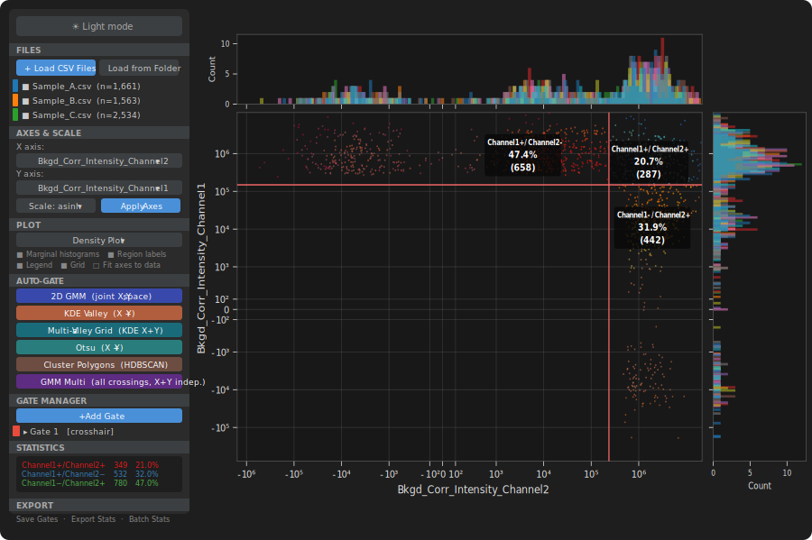
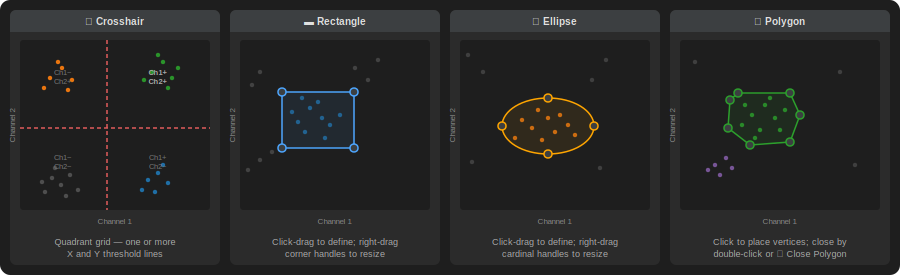
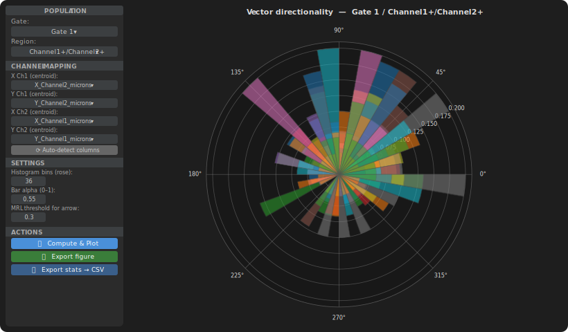

# vFlow

**Visual Flow Cytometry & Immunofluorescence Analysis Tool**

vFlow is a desktop application for interactive 2D gating, visualisation, and quantification of single-particle immunofluorescence data. It is designed for two complementary experimental contexts:

- **Flow cytometry** — standard `.fcs` or `.csv` list-mode files from any flow cytometer
- **Widefield immunofluorescence of nano/microparticles** — specifically the CSV outputs produced by the [IJ-Toolset SynaptosomesMacro](https://github.com/fabricecordelieres/IJ-Toolset_SynaptosomesMacro) for ImageJ/Fiji

In both cases the unit of analysis is the same: one row = one particle, columns = measured channels. vFlow treats these files identically and provides the gating, population quantification, and batch statistics that standard flow cytometry software provides for FCS data, applied to any single-particle measurement table.



---

## Changelog

### v3.9.5 — Concatenate & Export

- **Folder Scanner — Concatenate & Export section** — a new panel at the bottom of the Load from Folder dialog allows selected CSV files to be concatenated into a single pooled file without leaving the dialog:
  - **Save Only** — concatenates the ticked files, adds a `Source_File` column (basename of each source), and writes the result to a user-chosen folder and filename. The dialog stays open so additional files can still be loaded individually.
  - **Save & Load** — performs the same concatenation, saves the file, then immediately loads it into the main app as a single pooled dataset. Equivalent to manually merging files in a spreadsheet tool and then loading the result, but in one click.
  - FCS files are automatically skipped during concatenation (CSV-only) with a warning. Layout variants (unnamed leading index column vs. clean header) are both handled automatically.
  - Useful for combining per-acquisition `___CytoFile.csv` files from a single condition into a `Pooled_CytoFile.csv` directly within vFlow, without needing an external step.

### v3.9.4 — Bug fixes

- **Stats panel empty after gate placement** — root cause identified and fixed: `_gate_sig()`, the function that hashes gate geometry to form persistent cache keys, had two bugs introduced in v3.9.2:
  - **TypeError crash** (`tuple(None)`): `y_boundaries` is initialised to `None` for every manually-drawn crosshair gate; calling `tuple()` on that value raised `TypeError`, which silently aborted the entire `_finish_gate()` chain before the stats panel, cell colouring, or gate-manager row could be updated.
  - **Wrong cache-key fields**: the function read `x_thresh_active` / `y_thresh_active` (JSON serialisation keys) instead of reading the live `BooleanVar` objects stored under `x_thresh_vars` / `y_thresh_var`. Threshold toggle state was therefore never included in the cache key, so toggling a threshold left a stale cached mask in `_gmc` and stats / cell colours did not update.
  - Both issues now fixed; `_gate_sig` correctly reads `BooleanVar.get()` for live gates and falls back to plain `bool` for loaded/serialised gates, with all `tuple()` calls guarded against `None`.

### v3.9.3 — Bug fixes and Polar Analysis redesign

- **Region % labels not appearing after gating** — `_draw_region_labels()` was called before `_set_axis_scale()`, so text positions were resolved under the wrong coordinate transform; moved to after both `_set_axis_scale()` and "Fit axes to data"; added unconditional `canvas.draw_idle()` at end of `refresh_plot`.
- **Polar analysis: gate filter silently ignored** — `_get_population_mask` passed `_cache_path` to `_gate_mask_for`; cache entries built against the full DataFrame were returned unchanged for filtered sub-gate DataFrames of different length; now always computes fresh, with a length-safety guard in the cache.
- **Premature repaint in `_clear_preview`** — removed `draw_idle()` from `_clear_preview`; each interactive caller issues its own explicit flush.
- **Polar Analysis window redesigned** — one polar axes, files overlaid with `FILE_COLORS`, MRL + Rayleigh stats annotated per file, all output non-rasterised for true vector PDF/SVG export; removed below/above-threshold subplots, magnitude subplot, and view-mode switcher.
- **`_auto_detect_channels` robustness** — clears stale values before re-detection; updates combo value lists before `var.set()`; adds `centroid_x`/`centroid_y` fallback naming; removes duplicate `startswith` condition.

---

## Background: The SynaptosomesMacro Pipeline

The [IJ-Toolset SynaptosomesMacro](https://github.com/fabricecordelieres/IJ-Toolset_SynaptosomesMacro) (Cordélières et al.) is an ImageJ/Fiji toolset that quantifies protein proximity and recruitment on synaptosomes, isolated synaptic terminals imaged by widefield fluorescence microscopy, on a structure-by-structure basis.

**What the toolset does:**
1. Acquires dual- (or multi-) channel widefield images of immunolabelled particles
2. Pre-processes and segments individual structures from a fused multi-channel projection
3. Presents candidates to the user in a gallery for manual validation / rejection (aggregates, antibody precipitate, dust, etc.)
4. For each validated structure, extracts:
   - Mean fluorescence intensity per channel (raw and background-corrected)
   - Centroid coordinates per channel
   - Distance between channel centroids (a sub-resolution colocalization metric, calibrated in µm)
   - Local background from a donut-shaped ROI around each structure
5. Saves per-acquisition results as `___CytoFile.csv` and pools all acquisitions of a condition into `_Pooled_CytoFile.csv`
6. Optionally runs Monte Carlo randomization (via the RandomizerColocalization plugin) to produce a null-distribution colocalization reference in `Analysis_RandomizationResults.csv`

**vFlow is a downstream tool.** It reads those CytoFiles directly, provides the full 2D gating and population quantification workflow, and adds batch processing across all acquisitions of an experiment in a single operation.

---

### Typical CytoFile Column Structure

A `___CytoFile.csv` produced by the SynaptosomesMacro toolset typically contains columns such as:

| Column | Description |
|--------|-------------|
| `Intensity_Ch1` | Mean fluorescence intensity, channel 1 (e.g. Ch1-488) |
| `Intensity_Ch2` | Mean fluorescence intensity, channel 2 (e.g. Ch2-647) |
| `Bkgd_Corr_Intensity_Ch1` | Background-corrected intensity, channel 1 |
| `Bkgd_Corr_Intensity_Ch2` | Background-corrected intensity, channel 2 |
| `Background_Ch1` | Local background estimate, channel 1 |
| `Background_Ch2` | Local background estimate, channel 2 |
| `Distance` | Distance between Ch1 and Ch2 centroids (µm) |
| `X_Ch1`, `Y_Ch1` | Centroid coordinates, channel 1 |
| `X_Ch2`, `Y_Ch2` | Centroid coordinates, channel 2 |

Exact column names depend on the labelling tags entered in the toolset GUI and the version used. vFlow reads any CSV header automatically and populates the axis menus from whatever columns are present.

---

## Requirements

| Package | Version | Purpose |
|---------|---------|---------|
| Python | ≥ 3.9 | Runtime |
| numpy | any | Array math |
| pandas | any | Data loading |
| matplotlib | any | Rendering |
| scipy | any | KDE, signal processing, interpolation |
| scikit-learn | ≥ 1.3 | GMM auto-gating, HDBSCAN clustering |
| tkinter | bundled | GUI (standard library) |

```bash
pip install numpy pandas matplotlib scipy scikit-learn
```

scikit-learn is only required for the 2D GMM and Cluster Polygons auto-gate methods. All other features work without it.

---

## Quick Start

```bash
python vFlow_v3_9_5.py
```

1. Click **Load Files** or **Load from Folder** to open your `___CytoFile.csv`, `_Pooled_CytoFile.csv`, or `.fcs` files.
2. Select X and Y channels (e.g. `Bkgd_Corr_Intensity_Ch1` vs `Bkgd_Corr_Intensity_Ch2`) and click **Apply Axes**.
3. Choose a **Scale** for each axis (`asinh` at cofactor 150 is a good starting point for background-corrected immunofluorescence intensities).
4. Switch to **Density** or **Contour Plot** mode to reveal population structure.
5. Use one of the **Auto-Gate** buttons or draw a gate manually in **Draw** mode.
6. Read per-region counts and percentages in the **Statistics** panel.
7. Use **Batch Stats → Folder** to process an entire experiment folder and get one row per acquisition in a single CSV.

---

## Supported File Formats

### FCS files (`.fcs`, `.FCS`)
Pure-Python reader, no external dependencies. Supports:
- FCS 2.0, 3.0, and 3.1 standards
- `DATATYPE F` (float32), `D` (float64), and `I` (integer: 8, 16, 32-bit)
- Big-endian and little-endian byte orders
- `$PnE` log-decade encoding for integer channels
- Non-standard `$BEGINDATA` / `$ENDDATA` offsets written by some instruments
- Channel names prefer the stain/marker label (`$PnS`, e.g. `Ch1-488`) over the technical short name (`$PnN`)

### CSV files (`.csv`)
Standard comma-separated files. Each column is a channel; each row is one particle event. Headers required. This is the format produced by the SynaptosomesMacro toolset.

---

## Loading Data

### Load Files
Opens a file picker. Multiple files can be selected at once. Each file gets a distinct colour and appears as a checkbox row in the **FILES** panel. Uncheck a file to remove it from the plot without losing it.

### Load from Folder
Opens the **Folder Scanner** dialog. Select a root directory and optionally a filename suffix filter — the default `___CytoFile` matches the SynaptosomesMacro naming convention directly. The tool recursively scans all subfolders and lists every matching file. Use **Select All** / **Deselect All** or tick individual files before confirming.

#### Concatenate & Export *(v3.9.5)*
The Folder Scanner dialog includes a **⊞ Concatenate & Export** panel at the bottom. After ticking the files you want:

- **Save Only** — concatenates the selected CSV files into a single pooled file (with a `Source_File` column identifying each row's origin) and saves it to a chosen folder. The dialog remains open.
- **Save & Load** — performs the same concatenation, saves, then immediately loads the result into the app as a single merged dataset.

This replaces a common manual step of merging CSV files in a spreadsheet before loading into vFlow.

### Exclude / Restore
Each file row has an **✕** button. Excluded files move to the **EXCLUDED FILES** panel and can be restored at any time. Exclusion also propagates to Batch Stats: any file sharing an experiment-level filename prefix with an excluded file is automatically skipped — particularly useful for excluding a `_Pooled_CytoFile` without having to individually exclude every acquisition from the same condition.

### Clear All Files
Removes all loaded and excluded files after confirmation. Gates are preserved.

---

## View Modes

**Overlay** — all active (checked) files are plotted simultaneously on the same axes, each in its own colour. Useful for comparing conditions or acquisitions side by side.

**Cycle through** — displays one file at a time. Use **◀ Prev** / **Next ▶** to navigate. Useful for inspecting individual acquisitions before deciding to pool them.

---

## Axes and Scales

### Axes
Select any channel for X and Y. The menus show only channels present in all currently loaded files. Click **Apply Axes** to update the plot.

### Scales
Five axis scale types, independently selectable for X and Y:

| Scale | Description | Typical use |
|-------|-------------|-------------|
| **linear** | No transformation | Distance between centroids, raw coordinates |
| **log** | Base-10 logarithm | Strictly positive channels with wide dynamic range |
| **biexp** | Biexponential (linear near zero, log in tails) | Mixed positive/negative intensity values |
| **asinh** | `arcsinh(x / cofactor)` | Standard for immunofluorescence intensities; handles negative background-corrected values gracefully |
| **logicle** | Parameterised logicle transform | Alternative to biexp for data with significant electronic noise |

**Cofactor** controls the linear-to-log transition width for `asinh` and `logicle`. Default is 150. For SynaptosomesMacro data, cofactor 150–300 is typical depending on intensity scale.

---

## Plot Modes

### Dot Plot
Each particle is drawn as a single dot, coloured by file. Subsampled to 50,000 points for display when files are larger; all statistics use the full dataset.

### Density Plot
Points are coloured by local 2D density (dark blue = sparse, red = dense) using a Gaussian KDE evaluated on a 128×128 grid then interpolated per-point. Display is capped at 50,000 randomly sampled points so sparse outlier populations are never hidden. Useful for identifying the main particle cloud and its subpopulations at a glance.

### Contour Plot
Filled viridis contour levels with an outer boundary at a user-chosen probability level (2 %, 5 %, 10 %, or 20 %). Particles outside the boundary are drawn as individual dots so outlier populations remain visible. Good for presenting cytofluorograms directly comparable to those output by the SynaptosomesMacro toolset.

### Display Options (checkboxes)
| Option | Default | Effect |
|--------|---------|--------|
| Marginal histograms | On | Histogram panels above and to the right of the scatter plot |
| Region % labels on plot | On | IN / OUT counts and percentages drawn directly on the plot |
| Legend | On | File-name legend in the lower-left corner |
| Grid | On | Background grid |
| Fit axes to data | Off | Zooms to p0.5–p99.5 of the visible data with 5 % breathing room, centring the particle cloud in the viewport |

---

## Manual Gating

Enable **Draw** mode with the radio button, then select a gate type.

### Gate Types



**Crosshair (✛)**
One or more vertical X thresholds and one or more horizontal Y thresholds, dividing the plot into a rectangular grid. Each region is labelled with its channel combination (e.g. `Ch1+/Ch2+`). The natural gate type for classic quadrant analysis — separating single-positive, double-positive, and negative populations.

**Rectangle (▬)**
Click-drag to define a rectangular gate. Resize by right-dragging corner handles.

**Ellipse (⬭)**
Click-drag to define an elliptical gate. Better suited to the elliptical clusters typical in fluorescence scatter plots.

**Polygon (⬠)**
Click to place vertices one by one. Close with **✓ Close Polygon** or by double-clicking near the first vertex. Any shape — useful for irregularly shaped populations or for drawing around a visually identified cluster.

### Interaction
- **Left-drag in Draw mode** — creates or extends a gate
- **Right-drag on any handle** — reshapes the gate (works in any mode, including Off)
- **Double-click a region label** — opens that population in a new sub-gate tab
- **Gate mode Off** — disables accidental creation; double-click sub-gating still works

---

## Auto-Gating

Six automatic gate methods, all tunable via the **Sensitivity** slider (1–10, default 7). Moving the slider live re-runs the last-used method with a short debounce delay.

### 2D GMM — Joint X,Y space
Fits a Gaussian Mixture Model in the 2D transformed space, using the BIC to select 1–3 components. Thresholds at the valleys between component means. Best for well-separated elliptical populations — typical for clearly distinct Ch1+/Ch1− subpopulations.

### KDE Valley — X + Y
Detects the deepest KDE valley between two populations independently on each axis. Validated by requiring both flanking peaks to be substantially taller than the valley. Falls back to the 5 % left-tail edge for unimodal distributions. A reliable first choice for bimodal channels.

### Multi-Valley Grid — KDE X+Y
Finds all significant KDE valleys on each axis and places a full crosshair grid gate. Use when a channel has more than two populations (negative, dim-positive, bright-positive).

### Otsu — X + Y
Maximises between-class variance to find one threshold per axis. Fast and robust for clearly bimodal distributions.

### Mixed — GMM X + KDE Y
GMM on X, KDE valley on Y. Useful when one channel separates populations more cleanly than the other.

### Cluster Polygons — HDBSCAN 2D
Clusters all visible particles in 2D using HDBSCAN, wraps each cluster in a convex-hull polygon gate. Sensitivity controls minimum cluster size (high sensitivity = finds smaller subpopulations). Ideal for discovering unexpected subpopulations or for non-elliptical cluster shapes — for example, separating particle aggregates from single particles.

---

## Gate Manager

Lists all gates. For each gate: rename, toggle on/off, delete, or select as active. Multiple gates can be applied simultaneously. When more than one gate is active, statistics and labels switch to Venn partition mode showing every combination of gate memberships.

### Gate Info Panel
Shows numerical threshold values for the selected crosshair gate. Individual threshold lines can be toggled on/off independently.

---

## Sub-Gating

Any applied gate region can be opened as a **sub-gate tab**:

1. Set Gate Mode to **Off**
2. Apply a gate so region labels appear on the plot
3. Double-click any region label (e.g. `Ch1+ ⤵`)

A new tab opens pre-loaded with only the particles from that region. The sub-gate tab is a fully independent vFlow instance with its own axes, scale, plot mode, auto-gate, statistics, and export. This enables hierarchical gating — for example, first gate on FSC-H vs FM4-64-H to select intact synaptosomes, then sub-gate the positive population on Ch1 vs Ch2 to quantify co-labelled structures.

Right-click a sub-gate tab header to close it. The Main tab cannot be closed.

---

## Statistics Panel

Counts and percentages for all regions of the currently selected gate across all active files.

**Per file** — each file as a collapsible tree node. Useful for comparing individual acquisitions before pooling.

**Merged** — sums all active files into a single breakdown. The appropriate view for a fully pooled `_Pooled_CytoFile`.

When multiple gates are applied the panel shows every Venn combination (exclusive regions, overlaps, outside-all).

---

## Vector / Polar Analysis

The **Vector Analysis** window computes displacement vectors from paired centroid columns (e.g. `X_Ch1_microns`, `Y_Ch1_microns`, `X_Ch2_microns`, `Y_Ch2_microns`) and visualises their angular distribution as a polar rose histogram.



### Workflow

1. Apply a gate in the main window to select a population of interest (e.g. `Ch1+/Ch2+` double-positive structures).
2. Click **Vector Analysis** in the EXPORT section.
3. Select the gate and region in the **POPULATION** section of the sidebar.
4. Confirm or manually assign the four centroid columns under **CHANNEL MAPPING** (`X Ch1`, `Y Ch1`, `X Ch2`, `Y Ch2`). Click **⟳ Auto-detect** — the tool looks for columns matching `X_*_microns` / `Y_*_microns` naming automatically.
5. Set histogram bins (default 36), bar alpha, and MRL threshold (default 0.3).
6. Press **🔄 Compute & Plot**.

### What is plotted

For each active file, the displacement vector `(Δx, Δy) = Ch2 centroid − Ch1 centroid` is computed per row. The angular distribution of these vectors is rendered as a normalised polar rose histogram (each bar = fraction of vectors in that angular bin, so multi-file overlays are directly comparable regardless of cell count). All rendering is non-rasterised — PDF and SVG exports are true vector graphics.

Files are coloured with the same `FILE_COLORS` palette used in the main scatter plot, so the same experiment colours carry through to the polar figure.

### Statistics

Two circular statistics are computed per file and displayed as an annotation on the plot:

| Statistic | Description |
|-----------|-------------|
| **MRL** (Mean Resultant Length) | Ranges 0 (uniform) to 1 (perfectly aligned). Indicates the strength of directional preference. |
| **Rayleigh p-value** | Tests the null hypothesis of a uniform angular distribution. p < 0.05 indicates significant directionality. |

A mean-direction arrow is drawn when `MRL ≥ threshold` (configurable, default 0.3).

### Export
- **Export figure** — saves as PDF (vector), SVG (vector), or PNG. PDF/SVG output is fully resolution-independent.
- **Export stats → CSV** — one row per file with `N_vectors`, `MRL`, `Rayleigh_p`, `Mean_dir_deg`, `Significant`, and the four centroid column names.

---

## Export

### Save Gates → JSON
Saves all gate geometry, type, name, colour, and threshold toggle states to a `.json` file. Reload later and apply to files from a different condition with the same channel structure — useful for applying a gate defined on pooled data back to individual acquisitions.

### Load Gates ← JSON
Restores gates from a `.json` file. Existing gates are replaced after confirmation.

### Export Stats → CSV
Saves the current statistics panel to CSV — one row per region per file, with count and percentage columns.

### Export Gated Data → CSV
Saves the raw particle-level data for all gated populations. Each row is one particle with additional columns: `Source_File`, `Gate_Name`, `Gate_Region`, `Gate_Type`. Particles outside all gates are excluded. If no gates are applied, all particles from all active files are exported with a `Source_File` column only.

### Batch Stats → Folder

The primary workflow for processing a complete SynaptosomesMacro experiment.

1. Select a root folder (auto-detected from loaded files, or browsable)
2. Set the suffix filter — default `___CytoFile` matches the SynaptosomesMacro output naming exactly — and file type (CSV, FCS, or both)
3. The tool scans the folder tree recursively, applies the current gates to every matching file, and writes one wide-format CSV with **one row per acquisition, one column per gate × region combination**

Excluded files are skipped at two levels:
- **Direct exclusion** — any file whose path matches the excluded-files list
- **Family exclusion** — any file sharing an experiment-level filename prefix with an excluded file. For example, excluding `20241122_DA-FASS_Pooled_CytoFile` automatically skips all `…_1___CytoFile`, `…_2___CytoFile`, … from the same acquisition set, without needing to exclude each individually

A companion `_excluded.csv` log is always written alongside the main results, listing every skipped file and the reason.

### Export Figure → PDF / PNG / SVG
Saves the current scatter plot at 300 dpi. For vector formats (PDF, SVG, EPS) scatter points are automatically de-rasterised before saving for crisp output at any zoom level, then restored to rasterised state for normal interactive performance.

---

## Themes

**☀ Light** / **☾ Dark** toggle in the toolbar. The dark theme is the default.

---

## Performance

vFlow is designed to remain responsive at the dataset sizes typical in single-particle immunofluorescence experiments (5,000–100,000 events per file).

| Operation | Strategy |
|-----------|----------|
| Scatter rendering | Capped at 50,000 points drawn (random subsample); statistics always on full data |
| Density / contour KDE | Fitted on ≤ 30,000 subsampled points; evaluated on a 128×128 grid then interpolated |
| Coordinate transforms | Cached per `(file, x_channel, y_channel, x_scale, y_scale, cofactor)`; partial eviction on overflow |
| Gate masks | Cached per `(file, channels, gate_id, gate_geometry_hash)`; auto-invalidated on geometry or toggle change |
| Auto-gate KDE | Subsampled to 30,000 points before fitting |
| Marginal histograms | Binned from ≤ 30,000 subsampled values; bin edges from full data range |
| Sensitivity slider | Debounced at 350 ms; live re-runs the last auto-gate without a button click |
| Dot-size / alpha sliders | Debounced at 80 ms |

---

## Keyboard & Mouse Reference

| Action | Gesture |
|--------|---------|
| Draw gate | Left-drag (Draw mode on) |
| Reshape gate handle | Right-drag on handle dot (any mode) |
| Sub-gate into region | Double-click region label (Draw mode off) |
| Navigate files (Cycle mode) | **◀ Prev** / **Next ▶** buttons |
| Pan / zoom | Matplotlib toolbar at bottom of plot |
| Close sub-gate tab | Right-click tab header → Close Tab |

---

## Typical Workflow — SynaptosomesMacro Experiment

```
Upstream  (ImageJ/Fiji — IJ-Toolset SynaptosomesMacro)
───────────────────────────────────────────────────────
1. Acquire dual-channel widefield images of immunolabelled synaptosomes
2. Run toolset GUI → set labelling tags and segmentation parameters
3. Validate candidates in the gallery (click to reject aggregates/debris)
4. Output per acquisition:
     ___CytoFile.csv        ← per-particle intensities, backgrounds,
                               centroid coordinates, inter-channel distance
5. Pooled across acquisitions:
     _Pooled_CytoFile.csv   ← all validated particles from one condition
6. Optional colocalization control:
     Analysis_RandomizationResults.csv  ← Monte Carlo null distribution

Downstream  (vFlow)
───────────────────
7.  Load from Folder → suffix ___CytoFile
    → select all acquisitions from one condition
    Optional: use ⊞ Concatenate & Export → Save & Load to merge them
    into a single pooled file in one step  (new in v3.9.5)

8.  Apply axes:
      X → Bkgd_Corr_Intensity_Ch1      (channel 1 background-corrected)
      Y → Bkgd_Corr_Intensity_Ch2      (channel 2 background-corrected)

9.  Set both scales to asinh, cofactor 150–300
    Enable Density or Contour Plot to reveal population structure

10. Run KDE Valley or 2D GMM auto-gate for an initial threshold,
    fine-tune by dragging handles

11. Statistics panel → Merged:
      Ch1+/Ch2+     double-positive (co-labelled structures)
      Ch1+/Ch2−     Ch1-only
      Ch1−/Ch2+     Ch2-only
      Ch1−/Ch2−     double-negative

12. Double-click Ch1+/Ch2+ ⤵ → sub-gate tab opens with only
    those particles → gate on Distance or a third channel

13. Export Stats → CSV for the gate breakdown
    Export Gated Data → CSV for particle-level data
    (import to R / Python / Prism for statistical testing)

14. Back in the main tab:
    Batch Stats → Folder → suffix ___CytoFile → experiment root
    → one output CSV, one row per acquisition, across all conditions

15. Optional — Vector Analysis:
    Select Ch1+/Ch2+ gate → map X_Ch1_microns/Y_Ch1_microns
    and X_Ch2_microns/Y_Ch2_microns → Compute & Plot
    → polar rose histogram per condition with MRL and Rayleigh p
    → Export figure (PDF/SVG) or stats CSV
```

---

## Architecture

vFlow is a single-file Python application (~6,580 lines, v3.9.5).

**`FlowApp`** — complete analysis environment for one dataset view. Owns the matplotlib figure, all gate state, all file state, and the control panel. Runs standalone or embedded as a tab inside `FlowTabManager`.

**`FlowTabManager`** — manages a `ttk.Notebook` of multiple independent `FlowApp` instances. Handles sub-gate tab creation and passes filtered particle data from parent to child.

**`PolarAnalysisWindow`** — dedicated `tk.Toplevel` for vector directionality analysis. Reads paired centroid columns, computes displacement vectors, renders a polar rose histogram with one overlay per active file. All output is non-rasterised.

**`FolderScanDialog`** — modal dialog for recursive folder scanning with suffix filtering. Includes the Concatenate & Export panel for merging selected CSV files into a single pooled dataset.

**`BatchStatsDialog`** — modal dialog for configuring and previewing a batch statistics run.

Custom matplotlib scale classes (`BiexpScale`, `AsinhScale`, `LogicleScale`) are registered globally and work as first-class axis scales.

The FCS reader (`read_fcs`) has no external dependencies beyond numpy/pandas and Python's standard library.

---

## About

**vFlow** was designed as the downstream analysis complement to the [IJ-Toolset SynaptosomesMacro](https://github.com/fabricecordelieres/IJ-Toolset_SynaptosomesMacro) pipeline for single-particle immunofluorescence quantification of nano- and microparticles, and generalises naturally to any flow cytometry or single-particle measurement dataset.
